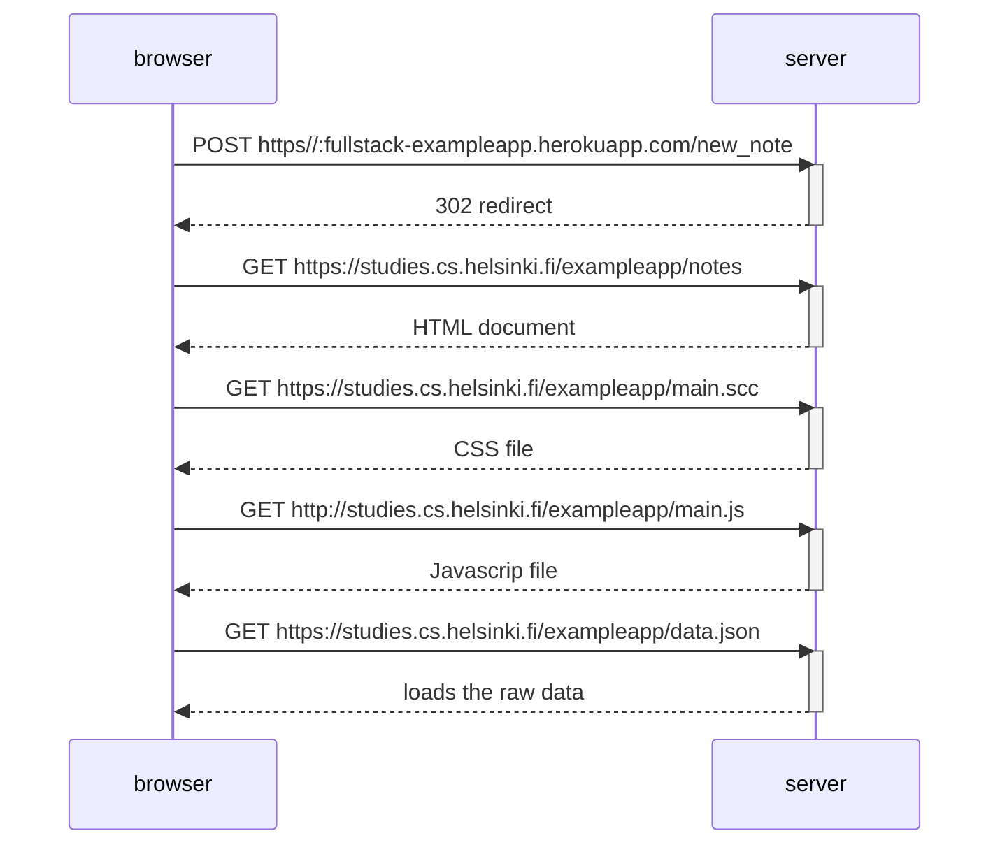

```mermaid

sequenceDiagram
    participant browser
    participant server

    browser->>server: POST https//:fullstack-exampleapp.herokuapp.com/new_note
    activate server
    server-->>browser: 302 redirect
    deactivate server

    browser->>server: GET https://studies.cs.helsinki.fi/exampleapp/notes
    activate server
    server-->>browser: HTML document
    deactivate server

    browser->>server: GET https://studies.cs.helsinki.fi/exampleapp/main.scc
    activate server
    server-->>browser: CSS file
    deactivate server

    browser->>server: GET http://studies.cs.helsinki.fi/exampleapp/main.js
    activate server
    server-->>browser: Javascrip file
    deactivate server

    browser->>server: GET https://studies.cs.helsinki.fi/exampleapp/data.json
    activate server
    server-->>browser: loads the raw data
    deactivate server

```
